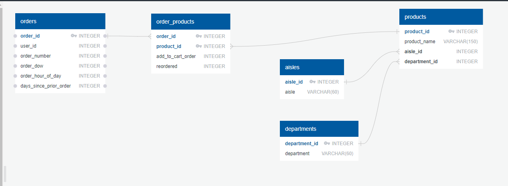

# Instacart Online Grocery Shopping Dataset Engineering & Analysis

## Introduction
This project leverages the Instacart Online Grocery Shopping Dataset 2017 to analyze user purchasing patterns and optimize data queries for large datasets. The dataset, provided by Instacart, includes over 3 million grocery orders from more than 200,000 users. Each user has between 4 and 100 orders, detailing the sequence of products purchased, the week and hour of day the order was placed, and a relative measure of time between orders.

## Tools
- **Database Design**: QuickDBD
- **Database Management**: Python ORM
- **Data Transformation**: Python Pandas
- **SQL Optimization and Analysis**: PostgreSQL

## Scope
The scope of this project includes:
1. Designing database models using QuickDBD.
2. Implementing the database models with Python ORM.
3. Transforming and importing the dataset into the database.
4. Analyzing user purchasing patterns through SQL queries.
5. Optimizing SQL queries to handle large datasets efficiently.

## Methodology


1. **Database Design**: Designed the database models using QuickDBD to create a structured and efficient schema following the normalization rules.
2. **Data Transformation**: Used Python Pandas to read the CSV files, transform the data as necessary, and load it into the respective tables in the database.
3. **Database Implementation**: Utilized Python ORM to run the QuickDBD models and manage database interactions.
4. **Query Optimization**: Optimized SQL queries to handle the large volume of data, improving run times significantly.

## Analysis Methodology
1. **Initial Data Load**: Imported over 3 million orders and 32 million order/product ID combinations into the database.
2. **SQL Analysis**: Conducted comprehensive SQL analysis to identify key trends and insights. The analysis scripts and table creation scripts are included in the repository.
   - [SQL Analysis Scripts](sql_scripts/analysis.sql)
   - [Table Creation Script](sql_scripts/table_creation.sql)
   
SQL Script Example
```sql
create temp table department_order_summary as  
select 
od.department_id,  
count(od.product_name) as total_purchases,
count(distinct od.product_name) as total_unique_purchases,
sum(case when od.order_dow between 1 and 5 then 1 else 0 end) as weekday_total_orders,
sum(case when od.order_dow = 0 or od.order_dow = 6 then 1 else 0 end) as weekend_total_orders,
round(avg(order_hour_of_day),2) as avg_order_hr
from order_details od
group by od.department_id
;
```
## Limitations
- **Run Times**: Initial run times for data processing and analysis were significantly high, requiring extensive query optimization.
- **Data Size**: Handling and analyzing large datasets posed challenges in terms of computational resources and efficiency.

## Future Work
- **BI Tool Integration**: Connect the analysis to a Business Intelligence (BI) tool to visualize the data and generate actionable insights.
- **Advanced Analytics**: Implement advanced analytics techniques such as machine learning models to predict user purchasing patterns and preferences.
- **Real-time Analysis**: Explore possibilities of real-time data analysis and visualization for more dynamic insights.

---

Feel free to provide any additional information or ask questions if further clarification is needed.
